<h1 align="center">🐙 Oktopus SOC</h1>

<p align="center">
  <strong>SIEM / IDS / IPS from scratch — Rise from the deep. Crush every threat.</strong>
</p>

<p align="center">
  
  
  
  
  
</p>

---
<p align="center">
  
</p>

## Table des matières

1. [Vue d'ensemble](#1-vue-densemble)
2. [Architecture globale](#2-architecture-globale)
3. [Composants](#3-composants)
4. [Flux de données](#4-flux-de-données)
5. [Installation](#5-installation)
6. [Lancement rapide](#6-lancement-rapide)
7. [Tests avec Kali Linux](#7-tests-avec-kali-linux)
8. [Module Agent](#8-module-agent)
9. [Module Serveur](#9-module-serveur)
10. [Moteur IDS](#10-moteur-ids)
11. [Moteur IPS](#11-moteur-ips)
12. [Dashboard Web](#12-dashboard-web)
13. [Base de données](#13-base-de-données)
14. [Protocoles de communication](#14-protocoles-de-communication)
15. [Configuration](#15-configuration)
16. [Monitoring système](#16-monitoring-système)
17. [Géo-IP — Carte monde](#17-géo-ip--carte-monde)
18. [MITRE ATT&CK](#18-mitre-attck)
19. [Agent Android (Termux)](#19-agent-android-termux)
20. [Tableau des fonctionnalités](#20-tableau-des-fonctionnalités)
21. [Structure des fichiers](#21-structure-des-fichiers)
22. [Limitations](#22-limitations)
23. [Auteur et contexte](#23-auteur-et-contexte)

---

## 1. Vue d'ensemble

**Oktopus SOC** est un **Security Operations Center** complet développé entièrement **from scratch** en Python (backend) et HTML/CSS/JS vanilla (frontend), sans aucun framework. Il implémente le cycle complet d'un SIEM :

```
Collecte → Transport → Parsing → Détection → Prévention → Géolocalisation → MITRE ATT&CK → Stockage → Monitoring → Visualisation
```

### Ce qu'il fait

| Capacité | Détail |
|----------|--------|
| **Collecte multi-OS** | Windows Event Logs, Linux syslog/auth.log, Android bash_history + batterie |
| **Transport TCP** | Agents → Serveur via JSON/TCP avec buffering et reconnexion auto |
| **Détection IDS** | 36+ règles regex, détection comportementale (seuils), détection contextuelle |
| **Prévention IPS** | Blocage IP firewall automatique (iptables / netsh), auto-unblock, whitelist |
| **Monitoring** | CPU, RAM, Swap, Disques, Réseau, Processus — temps réel par agent |
| **Géo-IP** | Carte monde Canvas Mercator avec localisation des IPs attaquantes |
| **MITRE ATT&CK** | 46+ mappings techniques, badges cliquables, graphe kill chain |
| **Dashboard** | 5 onglets temps réel, WebSocket, thème sombre glassmorphism |
| **Export** | CSV et JSON des logs filtrés |
| **Multi-agents** | Windows + Linux + Android simultanément, heartbeat, auto-reconnexion |

### Ce qu'il ne fait PAS

- ❌ Pas de chiffrement TLS (communication TCP en clair)
- ❌ Pas d'authentification dashboard
- ❌ Pas de machine learning / anomaly detection
- ❌ Pas de corrélation multi-sources
- ❌ Pas de scalabilité (SQLite mono-fichier)

> C'est un **POC académique** qui couvre les concepts fondamentaux d'un SOC, pas un outil de production.

---

## 2. Architecture globale

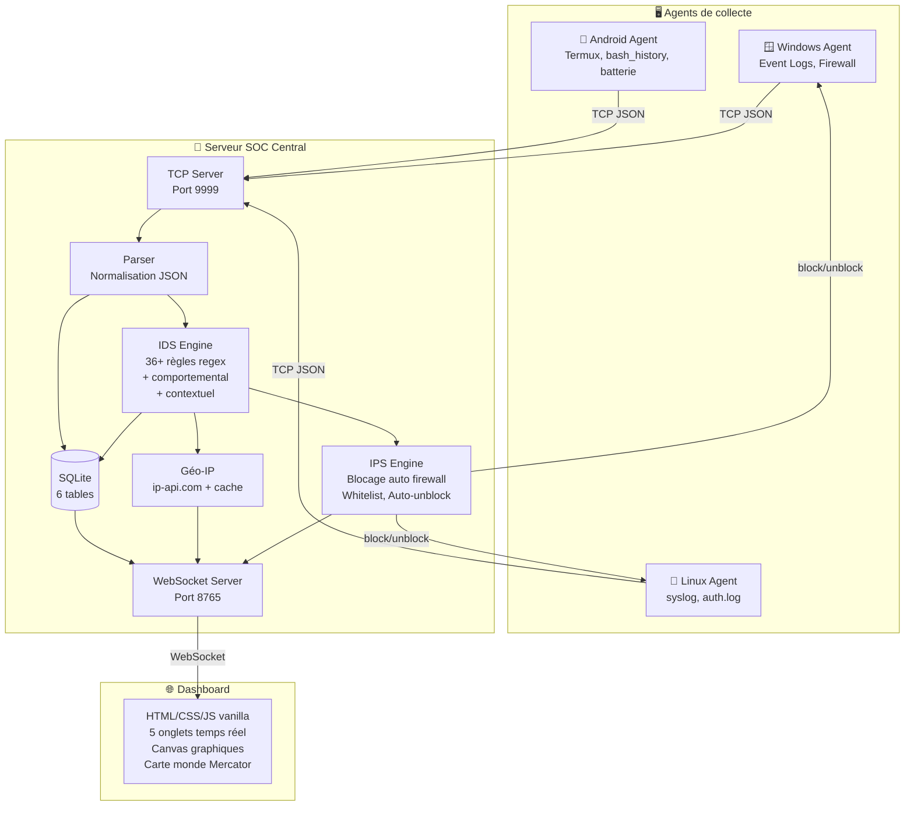

### Architecture simplifiée

```
┌──────────────┐     ┌──────────────┐     ┌──────────────┐
│ 🪟 Windows   │     │ 🐧 Linux     │     │ 📱 Android   │
│    Agent     │     │    Agent     │     │    Agent     │
└──────┬───────┘     └──────┬───────┘     └──────┬───────┘
       │    TCP/9999        │                    │
       └───────────────┬────┘────────────────────┘
                       ▼
              ┌────────────────┐
              │  🏢 Serveur    │
              │  Parser → IDS  │
              │  → IPS → DB   │
              │  → Géo-IP     │
              └───────┬────────┘
                      │  WebSocket/8765
                      ▼
              ┌────────────────┐
              │  🌐 Dashboard  │
              │  5 onglets     │
              │  Temps réel    │
              └────────────────┘
```

---

## 3. Composants

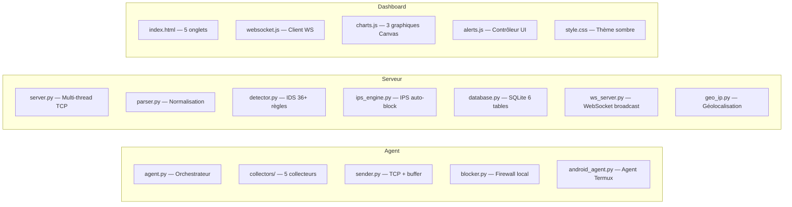

| Composant | Fichier | Rôle | Lignes |
|-----------|---------|------|--------|
| Orchestrateur Agent | `agent/agent.py` | Point d'entrée agent Windows/Linux | ~400 |
| Agent Android | `agent/android_agent.py` | Point d'entrée agent Termux | ~516 |
| Collecteur Windows | `agent/collectors/windows_collector.py` | Event Logs (Security, System, Application) | ~300 |
| Collecteur Linux | `agent/collectors/linux_collector.py` | syslog, auth.log, kern.log | ~250 |
| Collecteur Réseau | `agent/collectors/network_collector.py` | Connexions TCP suspectes | ~200 |
| Collecteur Système | `agent/collectors/system_collector.py` | CPU, RAM, Disque, Processus | ~250 |
| Collecteur Android | `agent/collectors/android_collector.py` | Batterie, bash_history, réseau Termux | ~809 |
| Sender TCP | `agent/sender.py` | Envoi JSON/TCP, buffer, reconnexion | ~280 |
| Blocker IPS | `agent/blocker.py` | iptables / netsh (firewall local) | ~200 |
| Serveur TCP | `server/server.py` | Multi-thread, un thread par agent | ~500 |
| Parser | `server/parser.py` | Normalisation JSON, extraction IPs | ~300 |
| Détecteur IDS | `server/detector.py` | 36+ règles regex + comportemental + MITRE | ~600 |
| Moteur IPS | `server/ips_engine.py` | Décision blocage, whitelist, auto-unblock | ~350 |
| Base de données | `server/database.py` | SQLite — 6 tables, index, nettoyage auto | ~400 |
| WebSocket | `server/ws_server.py` | Broadcast temps réel au dashboard | ~300 |
| Géo-IP | `server/geo_ip.py` | ip-api.com, cache TTL 1h, fallback LAN | ~200 |
| Dashboard HTML | `dashboard/index.html` | Page principale 5 onglets | ~400 |
| Dashboard JS | `dashboard/js/alerts.js` | UI, monitoring, alertes, export CSV/JSON | ~1500 |
| Graphiques | `dashboard/js/charts.js` | Timeline 24h + carte monde + barres MITRE | ~800 |
| WebSocket Client | `dashboard/js/websocket.js` | Client WS + reconnexion + callbacks | ~300 |

---

## 4. Flux de données

### Pipeline principal

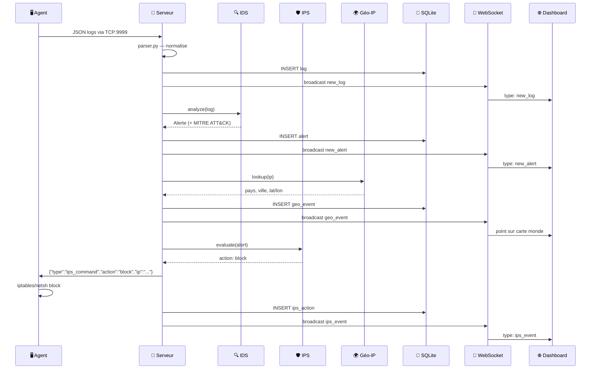

### Heartbeat & monitoring système

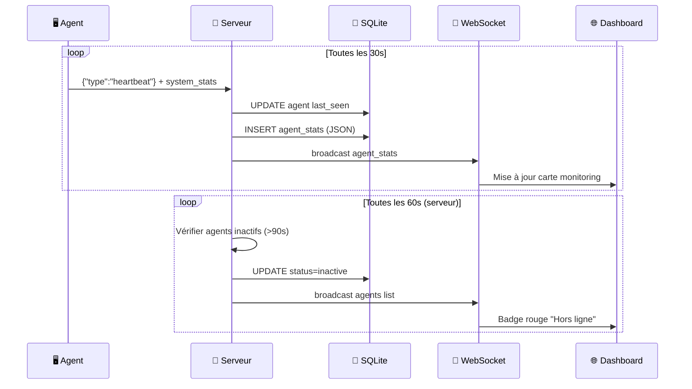

---

## 5. Installation

### Prérequis

- **Python 3.8+**
- **pip** (gestionnaire de paquets Python)
- **Droits administrateur** (Windows) ou **root** (Linux) pour les fonctions IPS

### Installation des dépendances

```bash
cd soc-system
pip install -r requirements.txt
```

**Contenu de `requirements.txt`** :
```
psutil
websockets
pywin32    # Optionnel — uniquement sur Windows pour les Event Logs
```

---

## 6. Lancement rapide

### Étape 1 — Démarrer le serveur

```bash
cd soc-system
python server/server.py
```

Le serveur démarre :
- **TCP** sur le port `9999` (écoute des agents)
- **WebSocket** sur le port `8765` (communication dashboard)
- **HTTP** sur le port `8000` (sert le dashboard)

### Étape 2 — Ouvrir le dashboard

```
http://localhost:8000
```

### Étape 3 — Lancer un agent

**Windows / Linux (même machine)** :
```bash
python -m agent.agent
```

**Linux distant (VM, autre machine)** :
```bash
python -m agent.agent --server 192.168.1.100 --port 9999
```

**Android (Termux)** :
```bash
python3 -m agent.android_agent --server 192.168.1.100 --port 9999
```

### Options de l'agent

| Option | Défaut | Description |
|--------|--------|-------------|
| `--server` | `127.0.0.1` | IP du serveur SOC |
| `--port` | `9999` | Port TCP du serveur |
| `--interval` | `5` | Intervalle de collecte (secondes) |
| `--agent-id` | *(auto)* | ID personnalisé de l'agent |

---

## 7. Tests avec Kali Linux

### Brute-force SSH (Hydra)

```bash
hydra -l admin -P /usr/share/wordlists/rockyou.txt ssh://192.168.1.100
```

### Scan de ports (Nmap)

```bash
nmap -sS -sV -O 192.168.1.100
```

### Injection SQL (sqlmap)

```bash
sqlmap -u "http://192.168.1.100/login?user=admin" --batch
```

### Scan web (Nikto)

```bash
nikto -h http://192.168.1.100
```

### Envoi de logs manuels (test rapide)

```bash
# Test injection SQL
echo '{"agent_id":"KALI-test","os":"linux","ip":"10.0.0.50","type":"logs","logs":[{"source":"apache","line":"SELECT * FROM users WHERE 1=1","timestamp":"2025-01-01 12:00:00","collector":"linux","level":"WARNING"}]}' | nc 192.168.1.100 9999

# Test brute force
for i in $(seq 1 10); do
  echo '{"agent_id":"KALI-test","os":"linux","ip":"10.0.0.50","type":"logs","logs":[{"source":"auth","line":"Failed password for admin from 10.0.0.50","timestamp":"2025-01-01 12:00:'$i'0","collector":"linux","level":"WARNING"}]}' | nc 192.168.1.100 9999
done
```

### Résultats attendus

| Attaque | Alerte générée | Sévérité | MITRE ATT&CK |
|---------|---------------|----------|---------------|
| Hydra SSH | SSH_BRUTE_FORCE | CRITICAL | T1110 Brute Force |
| Nmap scan | PORT_SCAN | HIGH | T1046 Network Service Discovery |
| sqlmap | SQL_INJECTION | CRITICAL | T1190 Exploit Public-Facing App |
| Nikto | RECONNAISSANCE | MEDIUM | T1595 Active Scanning |

---

## 8. Module Agent

### 8.1 Collecteurs

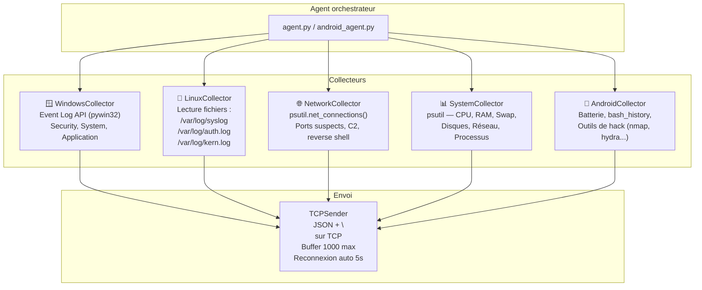

### 8.2 TCPSender (`agent/sender.py`)

| Fonctionnalité | Détail |
|----------------|--------|
| **Protocole** | JSON terminé par `\n` sur TCP persistant |
| **Buffer** | File circulaire (max 1000 messages) en cas de déconnexion |
| **Reconnexion** | Thread dédié, retry toutes les 5s avec backoff |
| **Registration** | `send_registration(agent_id, hostname, os_type, ip_address)` à la connexion |
| **Heartbeat** | `send_heartbeat(agent_id)` + system_stats toutes les 30s |
| **Thread-safe** | `threading.Lock` sur le socket et le buffer |

### 8.3 Blocker IPS (`agent/blocker.py`)

| Fonctionnalité | Détail |
|----------------|--------|
| **Windows** | `netsh advfirewall firewall add rule` / `delete rule` |
| **Linux** | `iptables -A INPUT -s IP -j DROP` / `iptables -D ...` |
| **Commandes** | Reçoit `block_ip` / `unblock_ip` depuis le serveur via TCP |
| **Logging** | Journal local `blocker.log` |
| **Robustesse** | Vérification de doublon avant blocage, nettoyage à l'arrêt |

### 8.4 ID persistant

L'agent génère un ID unique au premier lancement et le stocke dans `agent_id.txt` :
- **Format Windows/Linux** : `HOSTNAME-os-XXXXXX` (6 chars hex du UUID)
- **Format Android** : `ANDROID-hostname-XXXXXX`
- **Persistance** : Fichier `agent_id.txt` dans le répertoire courant

---

## 9. Module Serveur

### 9.1 Architecture multi-thread

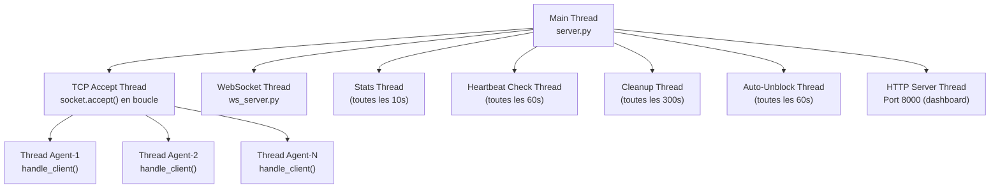

### 9.2 Pipeline de traitement (par log reçu)

1. **Réception TCP** → lecture ligne par ligne (`\n` delimiter)
2. **Parsing JSON** → `parser.py` normalise les champs
3. **Insertion DB** → `database.insert_log()` dans SQLite
4. **Broadcast log** → `ws_server.broadcast_log()` au dashboard
5. **Analyse IDS** → `detector.analyze()` retourne 0..N alertes
6. **Insertion alertes** → `database.insert_alert()` avec champs MITRE
7. **Lookup Géo-IP** → `geo_ip.lookup(ip)` pour les IPs publiques
8. **Évaluation IPS** → `ips_engine.evaluate()` → décision block/log/skip

---

## 10. Moteur IDS

### 10.1 Trois niveaux de détection

| Niveau | Méthode | Exemple |
|--------|---------|---------|
| **Regex** | Patterns hardcodés dans `detector.py` | `SELECT.*FROM.*WHERE.*=` → SQL_INJECTION |
| **Comportemental** | Seuils + fenêtre temporelle | 5 échecs login en 60s → BRUTE_FORCE |
| **Contextuel** | Port + heure + méta-données | Connexion port 4444 à 3h AM → C2_BEACON |

### 10.2 Règles de détection (36+)

| Catégorie | Règles | Sévérité max |
|-----------|--------|--------------|
| **Authentification** | SSH_BRUTE_FORCE, SSH_INVALID_USER, WINDOWS_LOGIN_FAILURE, MULTIPLE_AUTH_FAILURES, RDP_BRUTE_FORCE | CRITICAL |
| **Injection** | SQL_INJECTION, XSS_ATTACK, COMMAND_INJECTION, XML_INJECTION, PATH_TRAVERSAL | CRITICAL |
| **Scan / Recon** | PORT_SCAN, RECONNAISSANCE, NETWORK_SCAN | HIGH |
| **Malware / C2** | MALWARE_DOWNLOAD, C2_BEACON, DNS_TUNNELING, DNS_SUSPICIOUS, PROXY_TUNNEL | CRITICAL |
| **DDoS** | DDOS_SYN_FLOOD, DDOS_ICMP_FLOOD, DDOS_UDP_FLOOD, HTTP_FLOOD | CRITICAL |
| **Exploitation** | SMB_EXPLOIT, SMB_SUSPICIOUS, WEBSHELL_DETECTED | CRITICAL |
| **Escalade de privilège** | PRIVILEGE_ESCALATION, WINDOWS_PRIV_ESC, TOKEN_MANIPULATION | CRITICAL |
| **Post-exploitation** | DATA_EXFILTRATION, LATERAL_MOVEMENT, SUSPICIOUS_PROCESS, SUSPICIOUS_COMMAND | HIGH |
| **Persistance** | SCHEDULED_TASK_ABUSE, REGISTRY_PERSISTENCE, UNAUTHORIZED_ACCESS | HIGH |
| **Évasion** | LOG_TAMPERING, POWERSHELL_ENCODED, POWERSHELL_SUSPICIOUS | HIGH |
| **Flood malformé** | MALFORMED_DATA_FLOOD (comportemental — 10+ messages malformés en 60s) | CRITICAL |

### 10.3 Détection comportementale

Le moteur maintient des **compteurs glissants** en mémoire :

| Compteur | Seuil | Fenêtre | Alerte |
|----------|-------|---------|--------|
| Échecs auth par IP | 5 | 60s | BRUTE_FORCE_IP |
| Échecs auth par agent | 5 | 60s | BRUTE_FORCE_AGENT |
| SYN détectés | 50 | 60s | DDOS_SYN_FLOOD |
| Connexions par IP | 30 | 60s | CONNECTION_FLOOD |
| Messages malformés | 10 | 60s | MALFORMED_DATA_FLOOD |

---

## 11. Moteur IPS

### 11.1 Logique de décision

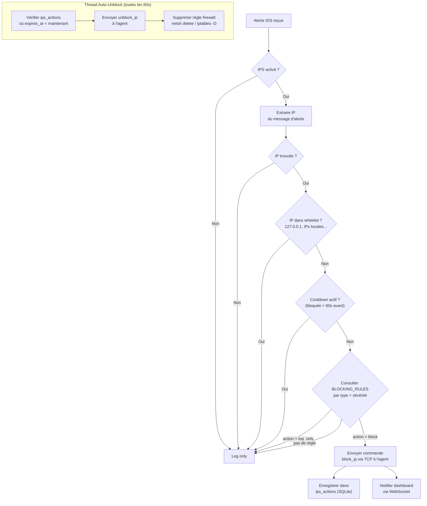

### 11.2 Durées de blocage par type

| Type de menace | CRITICAL | HIGH | MEDIUM |
|----------------|----------|------|--------|
| BRUTE_FORCE | 60 min | 30 min | log only |
| SQL_INJECTION | **permanent** | 120 min | 60 min |
| PORT_SCAN | 60 min | 30 min | log only |
| XSS | 60 min | 15 min | log only |
| MALWARE | **permanent** | 120 min | 60 min |
| PRIV_ESC | **permanent** | 60 min | — |
| EXFILTRATION | **permanent** | 120 min | — |
| DDOS | 30 min | 15 min | log only |
| SMB_EXPLOIT | **permanent** | 120 min | — |
| DNS_TUNNEL | **permanent** | 60 min | — |
| C2 | **permanent** | 120 min | — |
| LOG_TAMPERING | **permanent** | 60 min | — |

### 11.3 Whitelist

IPs jamais bloquées :
- `127.0.0.1`, `0.0.0.0`, `::1`, `localhost`
- Toutes les IPs locales du serveur (auto-détectées)
- IPs ajoutées manuellement via le dashboard

> ⚠️ L'IPS nécessite les droits **Administrateur** (Windows) ou **root** (Linux). Sur Android (Termux), l'IPS n'est pas disponible (pas de root).

---

## 12. Dashboard Web

### 12.1 Technologies

- **HTML5 / CSS3 / Vanilla JS** — zéro framework, zéro librairie
- **WebSocket** natif vers `ws://localhost:8765`
- **Canvas API** pour les graphiques (pas de Chart.js)
- Police **JetBrains Mono** via Google Fonts
- Design **glassmorphism** sur thème sombre

### 12.2 Les 5 onglets

| Onglet | Contenu |
|--------|---------|
| **📊 Vue d'ensemble** | Stats cards (logs, alertes, agents, CRITICAL/1h), timeline 24h (Canvas), carte monde Géo-IP (Canvas Mercator), graphique MITRE ATT&CK (barres horizontales), dernières alertes |
| **📋 Logs Live** | Table temps réel, filtres (niveau, agent, source, recherche full-text), export CSV/JSON, surbrillance, auto-scroll, max 500 logs |
| **🚨 Alertes** | Cards par alerte, badges MITRE ATT&CK (technique ID cliquable + tactique), filtres sévérité/type, bouton résoudre, afficher/masquer résolues |
| **🛡️ IPS** | Toggle activer/désactiver, IPs bloquées, historique des actions, gestion whitelist, bouton débloquer |
| **👥 Agents** | Liste agents, status actif/inactif, OS/IP/dernière activité, monitoring système temps réel (barres CPU/RAM/Swap/Disque, OS/Uptime, top 5 processus, réseau, CPU par cœur) |

### 12.3 Messages WebSocket

**Serveur → Dashboard** :

| Type | Quand | Contenu |
|------|-------|---------|
| `stats` | Toutes les 10s | Totaux logs, alertes actives, agents, CRITICAL/1h |
| `initial_logs` | Connexion | 50 derniers logs |
| `initial_alerts` | Connexion | 200 dernières alertes |
| `new_log` | Chaque log reçu | Log individuel |
| `new_alert` | Chaque alerte | Alerte + MITRE ATT&CK |
| `agents` | Changement d'état | Liste complète agents |
| `timeline` | Périodiquement | Données 24h pour graphique |
| `ips_event` | Blocage/déblocage | Action IPS |
| `initial_ips` | Connexion | IPs bloquées + historique + whitelist |
| `agent_stats` | Chaque collecte (30s) | Stats système d'un agent |
| `initial_agent_stats` | Connexion | Dernières stats de tous les agents |
| `geo_event` | Chaque alerte géolocalisée | IP, pays, ville, lat/lon, sévérité |
| `initial_geo` | Connexion | 100 derniers événements géo-IP |

**Dashboard → Serveur** :

| Commande | Description |
|----------|-------------|
| `resolve_alert` | Marquer une alerte comme résolue |
| `unblock_ip` | Débloquer manuellement une IP |
| `toggle_ips` | Activer/désactiver le moteur IPS |
| `add_whitelist` | Ajouter une IP à la whitelist |
| `remove_whitelist` | Retirer une IP de la whitelist |
| `get_stats` | Demander les stats à jour |
| `get_logs` | Demander des logs |
| `get_agents` | Demander la liste des agents |
| `get_agent_stats` | Stats système de tous les agents |
| `get_geo_events` | Derniers événements géo-IP |

---

## 13. Base de données

### 13.1 Schéma SQLite (6 tables)

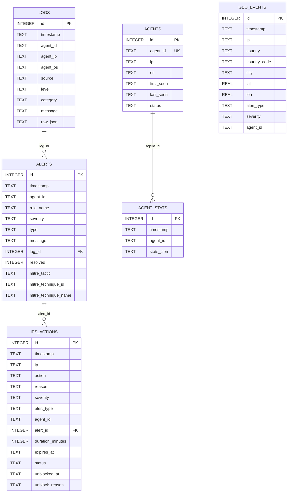

### 13.2 Index

- `idx_logs_timestamp`, `idx_logs_agent_id`, `idx_logs_level`
- `idx_alerts_timestamp`, `idx_alerts_severity`, `idx_alerts_resolved`
- `idx_agents_agent_id`
- `idx_ips_ip`, `idx_ips_status`
- `idx_agent_stats_agent_id`, `idx_agent_stats_timestamp`
- `idx_geo_events_timestamp`, `idx_geo_events_ip`

### 13.3 Accès concurrent

SQLite est accédé via un `threading.Lock` global (le serveur est multi-thread). Le nettoyage des `agent_stats` de plus de **48h** se fait automatiquement dans le thread Cleanup.

---

## 14. Protocoles de communication

### 14.1 Agent → Serveur (TCP port 9999)

**Protocole** : JSON terminé par `\n` sur TCP persistant.

**Message logs** :
```json
{
    "agent_id": "PC-DESKTOP-windows-a1b2c3",
    "os": "windows",
    "ip": "192.168.1.10",
    "timestamp": "2025-06-01T10:30:00",
    "type": "logs",
    "logs": [
        {
            "source": "Security",
            "line": "EventID 4625 - Failed login for user admin",
            "timestamp": "2025-06-01 10:30:00",
            "collector": "windows",
            "event_id": 4625,
            "level": "WARNING"
        }
    ]
}
```

**Message heartbeat** :
```json
{
    "type": "heartbeat",
    "agent_id": "PC-DESKTOP-windows-a1b2c3",
    "os": "windows",
    "ip": "192.168.1.10",
    "timestamp": "2025-06-01T10:30:30"
}
```

**Message system_stats** :
```json
{
    "type": "system_stats",
    "agent_id": "PC-DESKTOP-windows-a1b2c3",
    "os": "windows",
    "ip": "192.168.1.10",
    "system_stats": {
        "cpu": {"percent": 45.2, "cores": 8, "freq_mhz": 3600, "per_core": [42, 50, 38]},
        "ram": {"total_gb": 16.0, "used_gb": 8.5, "percent": 53.1},
        "swap": {"total_gb": 4.0, "used_gb": 0.8, "percent": 20.0},
        "disks": [{"mount": "C:\\", "total_gb": 500, "used_gb": 250, "percent": 50.0}],
        "network": {"bytes_sent_mb": 1024.5, "bytes_recv_mb": 2048.3, "connections": 42},
        "os_info": {"system": "Windows", "version": "10.0.19045", "hostname": "PC-DESKTOP"},
        "uptime": {"boot_time": "2025-06-01T08:00:00", "uptime_seconds": 9000, "uptime_human": "2h 30m 0s"},
        "top_processes": [{"pid": 1234, "name": "chrome.exe", "cpu_percent": 12.5, "memory_percent": 8.2}]
    }
}
```

### 14.2 Serveur → Agent (TCP, même connexion)

**Commande IPS** :
```json
{
    "type": "ips_command",
    "action": "block",
    "ip": "10.0.0.50",
    "reason": "SQL_INJECTION CRITICAL",
    "duration_minutes": 0,
    "alert_id": 42
}
```

### 14.3 Serveur → Dashboard (WebSocket port 8765)

```json
{"type": "new_log", "data": {"id": 1234, "timestamp": "...", "agent_id": "...", "message": "..."}}
{"type": "new_alert", "data": {"rule_name": "SQL_INJECTION", "severity": "CRITICAL", "mitre_tactic": "Initial Access", "mitre_technique_id": "T1190"}}
{"type": "agent_stats", "data": {"agent_id": "...", "stats": {"cpu": {...}, "ram": {...}, "battery": {...}}}}
{"type": "geo_event", "data": {"ip": "...", "country": "France", "city": "Paris", "lat": 48.85, "lon": 2.35}}
{"type": "ips_event", "data": {"action": "block", "ip": "10.0.0.50", "reason": "..."}}
```

---

## 15. Configuration

### 15.1 Fichier `config/rules.json`

```json
{
    "server": {
        "tcp_port": 9999,
        "ws_port": 8765,
        "db_path": "soc.db"
    },
    "detection": {
        "brute_force_threshold": 5,
        "brute_force_window_seconds": 60,
        "suspicious_ports": [4444, 1337, 31337, 6666, 9001],
        "ddos_syn_threshold": 50,
        "ddos_conn_threshold": 30
    },
    "ips": {
        "enabled": true,
        "cooldown_seconds": 60,
        "whitelist": []
    },
    "agent": {
        "default_server": "127.0.0.1",
        "default_port": 9999,
        "collect_interval": 5,
        "buffer_max": 1000
    }
}
```

> Les règles regex sont **hardcodées** dans `detector.py`, pas chargées depuis le JSON. Le JSON contient uniquement les seuils et la config des ports/serveurs.

### 15.2 Paramètres importants

| Paramètre | Description | Défaut |
|-----------|-------------|--------|
| `collect_interval` | Intervalle de collecte des logs (secondes) | `5` |
| `buffer_max` | Taille max du buffer en déconnexion | `1000` |
| `suspicious_ports` | Ports suspects (reverse shell, C2) | `[4444, 5555, ...]` |
| `brute_force_threshold` | Échecs avant alerte brute force | `5` |
| `brute_force_window_seconds` | Fenêtre pour la détection brute force | `60` |
| `ddos_syn_threshold` | SYN avant alerte DDoS | `50` |
| `ddos_conn_threshold` | Connexions avant alerte flood | `30` |
| `ips.enabled` | IPS activé au démarrage | `true` |
| `ips.cooldown_seconds` | Délai entre deux blocages d'une même IP | `60` |

---

## 16. Monitoring système

### 16.1 Vue d'ensemble

Inspiré de **Wazuh** et **Elastic Agent**, le monitoring permet de visualiser en temps réel les ressources système de chaque machine surveillée.

### 16.2 Architecture

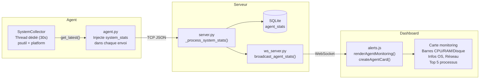

### 16.3 Données collectées

| Catégorie | Métriques | Source |
|-----------|----------|--------|
| **CPU** | Usage global (%), par cœur (%), fréquence MHz | `psutil.cpu_percent()` |
| **RAM** | Total GB, utilisé GB, pourcentage | `psutil.virtual_memory()` |
| **Swap** | Total GB, utilisé GB, pourcentage | `psutil.swap_memory()` |
| **Disques** | Par partition : mount, total/utilisé/libre GB, % | `psutil.disk_partitions()` |
| **Réseau** | Octets envoyés/reçus (MB), connexions actives | `psutil.net_io_counters()` |
| **OS** | Système, version, architecture, hostname | `platform` (stdlib) |
| **Uptime** | Boot time, durée, format lisible (Xh Ym Zs) | `psutil.boot_time()` |
| **Processus** | Top 5 par CPU : PID, nom, CPU%, RAM% | `psutil.process_iter()` |
| **Batterie** *(Android)* | Pourcentage, en charge, branché | `psutil.sensors_battery()` |

### 16.4 Rendu Dashboard

Chaque agent obtient une **carte glassmorphism** dans l'onglet Agents :

- **En-tête** : Nom agent + badge OS (🪟/🐧/📱) + uptime
- **Barres de progression** avec code couleur :
  - 🟢 Vert (< 60%) — 🟠 Orange (60-80%) — 🔴 Rouge (> 80%)
- **Disques** : Une barre par partition (Windows/Linux seulement)
- **Batterie** : Barre colorée + ⚡ si en charge (Android seulement)
- **Réseau** : Octets envoyés, reçus, connexions actives
- **OS** : Système, version, architecture, hostname
- **Processus** : Top 5 par CPU
- **CPU par cœur** : Mini-barres individuelles

### 16.5 Cycle de vie

1. **Collecte** → SystemCollector toutes les 30s en thread dédié
2. **Injection** → `get_latest()` ajouté à chaque message TCP
3. **Parsing** → `parser.py` préserve le champ `system_stats`
4. **Stockage** → `agent_stats` table (JSON sérialisé)
5. **Broadcast** → WebSocket temps réel
6. **Rendu** → Mise à jour carte agent dans le dashboard
7. **Nettoyage** → Stats > 48h purgées automatiquement

---

## 17. Géo-IP — Carte monde

### 17.1 Vue d'ensemble

Localise géographiquement les **IPs attaquantes** et les affiche en temps réel sur une **carte monde Canvas** (projection Mercator).

### 17.2 Architecture

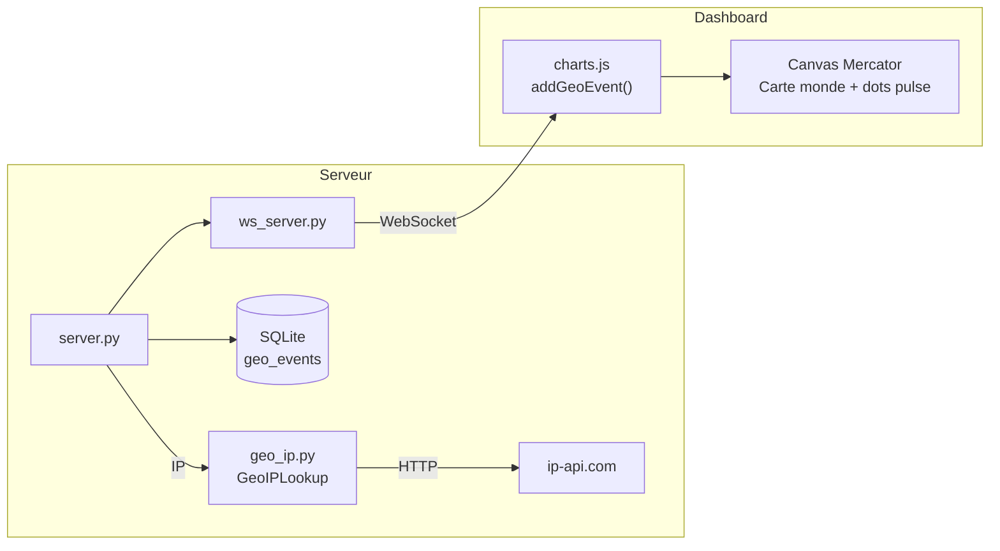

### 17.3 Service GeoIPLookup

| Fonctionnalité | Description |
|----------------|-------------|
| **API** | `http://ip-api.com/json/{IP}` (gratuit, sans clé) |
| **Limite** | 45 requêtes/minute |
| **Cache** | TTL 1h en mémoire, nettoyage périodique |
| **IPs privées** | RFC 1918, loopback → `"Réseau Local"` + coords Paris 🏠 |
| **IPs publiques** | Pays, ville, lat/lon, drapeau emoji Unicode |
| **Thread-safe** | `threading.Lock` sur le cache |

### 17.4 Carte monde Canvas

Rendue en **Canvas API pur** (0 librairie) :

- **Projection Mercator** : `lonToX()` / `latToY()`
- **9 polygones** de continents simplifiés
- **Points colorés par sévérité** : 🔴 CRITICAL, 🟠 HIGH, 🟡 MEDIUM, 🔵 LOW
- **Animation pulse** : halo pulsant pour attaques < 5 minutes (`requestAnimationFrame`)
- **Tooltip au survol** : drapeau + pays + ville + IP + type + sévérité
- **Légende** : overlay semi-transparent
- **Fond sombre** : `#0a0e1a` avec grille lat/lon

---

## 18. MITRE ATT&CK

### 18.1 Vue d'ensemble

Chaque alerte IDS est classifiée selon le framework **MITRE ATT&CK Enterprise** avec 3 champs :

| Champ | Description | Exemple |
|-------|-------------|---------|
| `mitre_tactic` | Tactique (phase de l'attaque) | `Credential Access` |
| `mitre_technique_id` | ID technique | `T1110` |
| `mitre_technique_name` | Nom technique | `Brute Force` |

### 18.2 Mapping complet (46+ règles)

| Règle IDS | Tactique | ID | Technique |
|-----------|----------|-----|-----------|
| SSH_BRUTE_FORCE | Credential Access | T1110 | Brute Force |
| SSH_INVALID_USER | Credential Access | T1110.001 | Password Guessing |
| WINDOWS_LOGIN_FAILURE | Credential Access | T1110 | Brute Force |
| MULTIPLE_AUTH_FAILURES | Credential Access | T1110 | Brute Force |
| RDP_BRUTE_FORCE | Credential Access | T1110 | Brute Force |
| SQL_INJECTION | Initial Access | T1190 | Exploit Public-Facing App |
| XSS_ATTACK | Initial Access | T1189 | Drive-by Compromise |
| PATH_TRAVERSAL | Initial Access | T1190 | Exploit Public-Facing App |
| COMMAND_INJECTION | Initial Access | T1190 | Exploit Public-Facing App |
| XML_INJECTION | Initial Access | T1190 | Exploit Public-Facing App |
| WEBSHELL_DETECTED | Initial Access | T1190 | Exploit Public-Facing App |
| PORT_SCAN | Discovery | T1046 | Network Service Discovery |
| NETWORK_SCAN | Discovery | T1046 | Network Service Discovery |
| RECONNAISSANCE | Reconnaissance | T1595 | Active Scanning |
| MALWARE_DOWNLOAD | Command and Control | T1105 | Ingress Tool Transfer |
| C2_BEACON | Command and Control | T1071 | Application Layer Protocol |
| DNS_TUNNELING | Command and Control | T1071.004 | Application Layer: DNS |
| DNS_SUSPICIOUS | Command and Control | T1071.004 | Application Layer: DNS |
| PROXY_TUNNEL | Command and Control | T1090.003 | Multi-hop Proxy |
| DDOS_SYN_FLOOD | Impact | T1498 | Network Denial of Service |
| DDOS_ICMP_FLOOD | Impact | T1498 | Network Denial of Service |
| DDOS_UDP_FLOOD | Impact | T1498 | Network Denial of Service |
| HTTP_FLOOD | Impact | T1499 | Endpoint Denial of Service |
| MALFORMED_DATA_FLOOD | Impact | T1498 | Network Denial of Service |
| SMB_EXPLOIT | Lateral Movement | T1210 | Exploitation of Remote Services |
| SMB_SUSPICIOUS | Lateral Movement | T1021.002 | Remote Services: SMB |
| LATERAL_MOVEMENT | Lateral Movement | T1021 | Remote Services |
| SUSPICIOUS_PROCESS | Execution | T1059 | Command and Scripting Interpreter |
| SUSPICIOUS_COMMAND | Execution | T1059 | Command and Scripting Interpreter |
| POWERSHELL_SUSPICIOUS | Execution | T1059 | Command and Scripting Interpreter |
| POWERSHELL_ENCODED | Execution | T1059.001 | PowerShell |
| SHELL_COMMAND | Execution | T1059 | Command and Scripting Interpreter |
| PRIVILEGE_ESCALATION | Privilege Escalation | T1548 | Abuse Elevation Control |
| WINDOWS_PRIV_ESC | Privilege Escalation | T1548 | Abuse Elevation Control |
| TOKEN_MANIPULATION | Defense Evasion | T1134 | Access Token Manipulation |
| LOG_TAMPERING | Defense Evasion | T1070 | Indicator Removal |
| DATA_EXFILTRATION | Exfiltration | T1048 | Exfiltration Over Alt Protocol |
| SCHEDULED_TASK_ABUSE | Persistence | T1053 | Scheduled Task/Job |
| REGISTRY_PERSISTENCE | Persistence | T1547.001 | Registry Run Keys |
| UNAUTHORIZED_ACCESS | Persistence | T1133 | External Remote Services |
| *BRUTE_FORCE_IP (comportemental)* | Credential Access | T1110 | Brute Force |
| *BRUTE_FORCE_AGENT (comportemental)* | Credential Access | T1110 | Brute Force |
| *SUSPICIOUS_PORT (contextuel)* | Command and Control | T1571 | Non-Standard Port |
| *OFF_HOURS_ACCESS (contextuel)* | Defense Evasion | T1036 | Masquerading |

### 18.3 Rendu Dashboard

**Badges sur les alertes** :
- Badge **technique** (cyan) : lien cliquable vers `https://attack.mitre.org/techniques/{ID}`
- Badge **tactique** (gris) : nom de la tactique

**Graphique barres MITRE ATT&CK** (Canvas) : 14 tactiques dans l'ordre de la **kill chain** :

```
Reconnaissance → Resource Development → Initial Access → Execution →
Persistence → Privilege Escalation → Defense Evasion → Credential Access →
Discovery → Lateral Movement → Collection → Command and Control →
Exfiltration → Impact
```

Code couleur des barres :
- 🟢 Vert (< 3 alertes) — 🟠 Orange (3-6 alertes) — 🔴 Rouge (≥ 7 alertes)

---

## 19. Agent Android (Termux)

### 19.1 Vue d'ensemble

L'agent Android permet de surveiller un **téléphone Android** via **Termux** (terminal Linux sans root). Il collecte les mêmes types de données que les agents standard, avec des spécificités Android : batterie, commandes suspectes dans bash_history.

### 19.2 Architecture

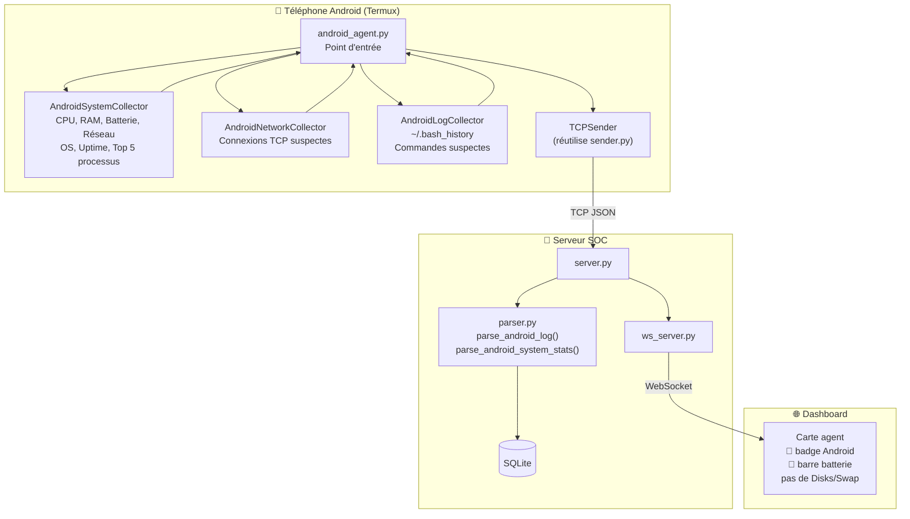

### 19.3 Installation rapide

```bash
# 1. Installer Termux depuis F-Droid (PAS Google Play)
# https://f-droid.org/packages/com.termux/

# 2. Copier les fichiers sur le téléphone (USB, scp, ou git clone)
# Seulement 5 fichiers nécessaires :
#   agent/__init__.py
#   agent/android_agent.py
#   agent/sender.py
#   agent/install_android.sh
#   agent/collectors/__init__.py
#   agent/collectors/android_collector.py

# 3. Lancer l'installation
cd soc-system
bash agent/install_android.sh
```

Le script `install_android.sh` :
- Met à jour Termux (`pkg update/upgrade`)
- Installe Python 3, pip, git, net-tools
- Installe `psutil` via pip
- Vérifie l'accès batterie et connexions réseau

### 19.4 Lancement

```bash
# Basique
python3 -m agent.android_agent --server 192.168.1.100

# Options complètes
python3 -m agent.android_agent --server 192.168.1.100 --port 9999 --interval 10

# ID personnalisé
python3 -m agent.android_agent --agent-id ANDROID-MonTel-abc123
```

| Option | Défaut | Description |
|--------|--------|-------------|
| `--server` | `127.0.0.1` | IP du serveur SOC |
| `--port` | `9999` | Port TCP |
| `--interval` | `5` | Intervalle de collecte (secondes) |
| `--agent-id` | *(auto)* | ID agent (format: `ANDROID-hostname-XXXXXX`) |

### 19.5 Collecteurs Android

| Collecteur | Données | Intervalle |
|------------|---------|------------|
| `AndroidSystemCollector` | CPU, RAM, Batterie, Réseau, OS, Uptime, Top 5 processus | 30s (thread) |
| `AndroidNetworkCollector` | Connexions TCP actives, ports suspects (4444, 1337...) | Chaque collecte |
| `AndroidLogCollector` | `~/.bash_history` — détecte outils de hack | Chaque collecte |

### 19.6 Batterie

- Via `psutil.sensors_battery()`
- Peut retourner `None` sur certains appareils → géré (`percent: -1`)
- Champs : `percent`, `charging`, `plugged`
- Dashboard : barre colorée (🔴 < 20%, 🟠 20-50%, 🟢 > 50%) + ⚡ si en charge

### 19.7 Commandes suspectes détectées

L'`AndroidLogCollector` surveille `~/.bash_history` et génère des alertes **HIGH** :

| Catégorie | Outils |
|-----------|--------|
| **Scan réseau** | `nmap`, `masscan`, `nikto`, `gobuster`, `dirb` |
| **Brute force** | `hydra`, `john`, `hashcat`, `crackmapexec` |
| **Exploitation** | `sqlmap`, `msfconsole`, `msfvenom`, `metasploit` |
| **Wireless** | `aircrack`, `airmon`, `aireplay`, `airodump` |
| **Post-exploitation** | `mimikatz`, `meterpreter`, `reverse_tcp`, `nc` |
| **Sniffing** | `tcpdump -w`, `wireshark`, `tshark`, `ettercap`, `arpspoof` |
| **Web** | `burpsuite`, `wpscan`, `beef-xss`, `enum4linux` |

### 19.8 Différences avec l'agent standard

| | Agent standard | Agent Android |
|-|----------------|---------------|
| **Point d'entrée** | `agent.py` | `android_agent.py` |
| **OS** | `windows` / `linux` | `android` |
| **ID** | `HOSTNAME-os-XXXXXX` | `ANDROID-hostname-XXXXXX` |
| **Batterie** | ❌ | ✅ |
| **Swap / Disques** | ✅ | ❌ |
| **IPS / Blocker** | ✅ (iptables/netsh) | ❌ (pas de root) |
| **Logs OS** | Event Log / syslog | bash_history |
| **Dashboard** | 🖥️ + Disque/Swap | 📱 + Batterie |

### 19.9 Limitations Android

| Limitation | Raison |
|-----------|--------|
| Pas d'IPS / blocage | Pas de root sur Termux |
| Batterie → `None` | Certains appareils/kernels |
| `net_connections()` limité | Pas de root |
| Pas de logs système | Android ne donne pas accès à `/var/log` |
| Termux requis | F-Droid obligatoire |

### 19.10 Tutoriel complet : de zéro à agent actif

#### Étape 1 — Installer Termux

1. Sur votre téléphone, ouvrez le navigateur :
   ```
   https://f-droid.org/packages/com.termux/
   ```
   ⚠️ **PAS Google Play** — uniquement F-Droid

2. Téléchargez l'APK → installez → lancez Termux

#### Étape 2 — Préparer les fichiers

Copiez **seulement ces fichiers** sur le téléphone :

```
agent/
  __init__.py
  android_agent.py
  sender.py
  install_android.sh
  collectors/
    __init__.py
    android_collector.py
```

**Options de transfert** :
- **USB** : Branchez le téléphone, copiez dans le dossier home de Termux
- **SCP** : `scp -r user@pc:/chemin/soc-system/agent ~/`
- **Git** : `apt install git && git clone https://github.com/votre-compte/soc-system.git`

#### Étape 3 — Installer les dépendances

```bash
cd ~/soc-system
bash agent/install_android.sh
```

Attendez **3-5 minutes**. À la fin :
```
✓ Batterie accessible: percent=85%, plugged=True
✓ Connexions réseau : 12 active(s)
✓ ✓ ✓ Installation réussie !
```

#### Étape 4 — Lancer l'agent

```bash
python3 -m agent.android_agent --server 192.168.1.100 --port 9999
```

Sortie attendue :
```
INFO | Android detected (Termux environment)
INFO | Agent ID: ANDROID-mobilephone-a1b2c3
INFO | Connecting to 192.168.1.100:9999...
INFO | ✓ Connected!
INFO | [Stats] CPU: 15.3%, RAM: 42%, Battery: 85%
```

#### Étape 5 — Vérifier sur le dashboard

Ouvrez `http://localhost:8000` → onglet **Agents** :
- 📱 Badge Android vert
- 🔋 Barre batterie
- Status "En ligne"
- Monitoring CPU/RAM/Réseau en temps réel

#### Étape 6 — Options avancées

```bash
# Intervalle personnalisé
python3 -m agent.android_agent --server 192.168.1.100 --interval 10

# ID personnalisé
python3 -m agent.android_agent --server 192.168.1.100 --agent-id ANDROID-MonTel

# Arrêter
Ctrl + C    # Graceful shutdown
```

#### Troubleshooting

| Problème | Solution |
|----------|----------|
| `ModuleNotFoundError: psutil` | `pip install psutil` |
| `Connection refused` | Vérifier que le serveur tourne + IP correcte |
| Batterie = N/A | Normal sur certains appareils |
| Permissions net_connections | Normal sans root — fonctionne partiellement |
| Agent quitte immédiatement | Vérifier connexion serveur + logs |

---

## 20. Tableau des fonctionnalités

| Fonctionnalité | Description | Inspiré de |
|----------------|-------------|------------|
| **Log Collection** | Windows Event Log + Linux syslog + Android bash_history | Wazuh Agent |
| **IDS Engine** | 36+ règles regex + détection comportementale (seuils) | Snort / Suricata |
| **IPS Engine** | Blocage auto iptables/netsh, durées configurables, whitelist | Wazuh Active Response |
| **System Monitoring** | CPU / RAM / Disque / Réseau temps réel par agent | Elastic Agent |
| **Agent Android** | Surveillance téléphone via Termux — batterie, réseau, bash_history | Wazuh Agent Mobile |
| **Geo-IP Map** | Carte monde Canvas Mercator temps réel | Kibana Maps |
| **MITRE ATT&CK** | 46+ mappings, badges cliquables, graphe kill chain | Elastic Security |
| **Live Dashboard** | WebSocket, 5 onglets, glassmorphism, toasts | Kibana |
| **Multi-Agent** | N agents simultanés, heartbeat, reconnexion auto | Wazuh Manager |
| **Export Logs** | Export CSV et JSON des logs filtrés | Splunk Export |
| **Recherche Full-Text** | Recherche tous champs + surbrillance temps réel | Elastic Search Bar |

---

## 21. Structure des fichiers

```
soc-system/
├── README.md                          # Documentation complète
├── requirements.txt                   # Dépendances Python
├── agent_id.txt                       # ID persistant de l'agent local
│
├── agent/                             # 🖥️ Agents de collecte
│   ├── __init__.py
│   ├── agent.py                       # Orchestrateur Windows/Linux
│   ├── android_agent.py               # 📱 Agent Android Termux
│   ├── blocker.py                     # IPS — blocage firewall local
│   ├── sender.py                      # Envoi TCP + buffer + reconnexion
│   ├── install_android.sh             # 📱 Script installation Termux
│   └── collectors/
│       ├── __init__.py                # Import conditionnel (try/except)
│       ├── windows_collector.py       # 🪟 Event Logs (pywin32)
│       ├── linux_collector.py         # 🐧 syslog, auth.log, kern.log
│       ├── network_collector.py       # 🌐 Connexions TCP suspectes
│       ├── system_collector.py        # 📊 CPU, RAM, Disque, Processus
│       └── android_collector.py       # 📱 Batterie, bash_history, réseau
│
├── server/                            # 🏢 Serveur SOC central
│   ├── __init__.py
│   ├── server.py                      # TCP multi-thread + HTTP
│   ├── parser.py                      # Normalisation JSON + Android
│   ├── detector.py                    # IDS — 36+ règles + MITRE ATT&CK
│   ├── ips_engine.py                  # IPS — blocage auto + whitelist
│   ├── database.py                    # SQLite — 6 tables + index + cleanup
│   ├── geo_ip.py                      # Géo-IP — ip-api.com + cache
│   └── ws_server.py                   # WebSocket temps réel
│
├── config/
│   └── rules.json                     # Configuration seuils et ports
│
└── dashboard/                         # 🌐 Interface web
    ├── index.html                     # 5 onglets
    ├── css/
    │   └── style.css                  # Thème sombre glassmorphism
    ├── js/
    │   ├── websocket.js               # Client WS + reconnexion + callbacks
    │   ├── charts.js                  # 3 Canvas : timeline + carte monde + MITRE
    │   └── alerts.js                  # UI, monitoring, alertes, export CSV/JSON
    └── img/                           # Logos et screenshots
```

---

## 22. Limitations

Ce projet est un **POC académique**. Voici ses limites connues :

| Limitation | Impact | Solution en production |
|-----------|--------|----------------------|
| ❌ Pas de TLS | Communication TCP en clair | TLS avec certificats |
| ❌ Pas d'authentification | Dashboard accessible sans login | OAuth2 / LDAP |
| ❌ SQLite mono-fichier | Pas de scalabilité | PostgreSQL / Elasticsearch |
| ❌ Détection regex sans ML | Faux positifs possibles | ML anomaly detection |
| ❌ Pas de corrélation | Logs analysés indépendamment | Moteur de corrélation |
| ❌ Pas de clustering | Un seul serveur | Architecture distribuée |
| ❌ Géo-IP basique | ip-api.com rate-limité | MaxMind GeoIP2 |
| ❌ Pas de rétention | Pas d'archivage long terme | Rotation + archivage |
| ❌ Android sans IPS | Pas de root Termux | Root ou MDM |

---

## 23. Auteur et contexte

### Contexte académique

Projet développé dans le cadre du cours de **Sécurité des Architectures Réseaux**, **ING-4 Semestre 2**, école **SSIR**.

### Objectif pédagogique

Comprendre et implémenter les concepts fondamentaux d'un SOC :
- Collecte et normalisation de logs multi-OS
- Détection d'intrusions (IDS) par règles et seuils
- Prévention d'intrusions (IPS) par blocage actif
- Monitoring système temps réel des agents
- Géolocalisation des attaques
- Classification MITRE ATT&CK
- Visualisation temps réel et réponse aux incidents

### Stack technique

| Couche | Technologie |
|--------|-------------|
| **Backend** | Python 3.8+ (from scratch, aucun framework) |
| **Frontend** | HTML / CSS / JS vanilla (zéro framework) |
| **Base de données** | SQLite |
| **Communication** | TCP sockets + WebSocket |
| **Dépendances** | psutil, websockets, pywin32 (optionnel) |

### Le cycle complet

```
Collecte → Transport → Parsing → Détection → Prévention → Géolocalisation → MITRE ATT&CK → Stockage → Monitoring → Visualisation
```

---

<p align="center">
  <strong>🐙 Oktopus SOC — Rise from the deep. Crush every threat. 🐙</strong>
</p>
